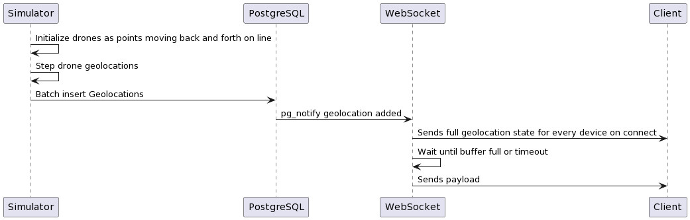

# Drone Tracking Simulator

Simulates ingestion of drone geolocation data and displays it on a map in realtime.

[The project is (was) live here! It's now offline.](https://map-project-r2zv.onrender.com)

[DroneTrackerDemoLowerQuality.webm](https://github.com/NinjaPerson24119/Drone-Tracking-Simulator/assets/32471098/13d34e03-45b7-4438-af5d-64f4bfe07786)

## Features
- Displays a map with drone locations in realtime.
- Drone locations are simulated by a backend service that moves them on a linear path defined by
  - a starting point in a circle
  - a direction
  - drones move back and forth along this vector and turn around when they reach the circle's edge
- Zooming out the map will group drones together if they are within a certain distance of each other.
- Clicking on a drone will zoom in until the group is expanded

## Tech Stack
- Frontend
  - React + Next.js
- Backend
  - Golang / Gin
  - Websockets
- Persistent Storage
  - PostgreSQL
- Hosting
  - Render.com for frontend and backend
  - Google Cloud SQL for PostgreSQL

## Architecture

The simulator is a goroutine that inserts geolocation data on a periodic basis. The websocket server sends all locations to the client on connection, and then sends updates as they come in. Updates are notified by listening to `pg_notify` on the database. This is triggered on every row insertion to the geolocation table. To avoid triggering too many rerenders on the client, updates are sent when a buffer size is reached, or when a minimum time has passed since the last update.

On the frontend, the map is rendered using Mapbox GL JS. The map is initialized with a cluster layer that groups drones together when they are within a certain distance of each other. Clicking on a cluster will zoom in until the cluster is expanded. This feature is mostly [reference code from this example](https://docs.mapbox.com/mapbox-gl-js/example/cluster/), as it's supported nearly out of the box.

## Results

The current software can run at ~10FPS with 15 drones before the simulator exceeds its allocated time budget per step.
As the number of drones increases, DB latency becomes an issue, and the drone movement begins to get choppy and resemble... teleportation.

The DB latency seems to scale OK beyond this point, but the simulator's time budget is still exceeded, so it doesn't matter.
If I could reduce this latency slightly, it might scale quite a bit better, and I could probably get >100 drones.

If I took a write-after-relay strategy as described in the major pitfall section, I think I could scale to arbitrarily many drones, since the server becomes a relay, and the bottleneck moves from the DB to the network connection from device to server to client.

## Major Pitfall

Firstly, I assumed that the desired result was not true "real-time". Without a physical connection, network conditions are highly variable.
A solution that updates a few times per second, and smooths motion on the client would be more than sufficient.

As such, I wanted to use PostgreSQL as the source of truth. I'm used to subscribing to DB events as a common pattern for executing events.
There's no room for an error where a location is sent out, but doesn't get written to history, for example.

However, the latency is kind of high. On average, my simulator's bulk insert takes ~130ms per step, which limits the framerate to ~7.5fps.
This means that even with a write-after-relay strategy where the data ingestion layer relays location data directly to the websocket, and then writes to the DB in the background, the database would perpetually get further and further behind.

I think a good solutions for this would be to:
- Write the location data directly to the websocket server
- Discard data beyond a certain resolution, since it's not really necessary to store history at a resolution more than a couple updates per second.

I would still rather optimize the write-rate to the DB though, since this maximizes the data durability and avoids needing to implement a messaging system that could be painful to scale.

## Other Pitfalls

- The intuitive solution to rendering the drones on MapBox is to use markers, but this brings the renderer to a crawl
  - I had to swap my implementation to use symbol layers instead 
- Websockets are fragile and their implementations are inconsistent
  - Browsers don't send pings, so I had to implement a user-level heartbeat to detect if the server crashed

## Deployment Considerations

The web server itself could run on a potato, but Render.com has very poor resource allocation for their PostgreSQL instances.
I was regularly getting round trip queries of >1 second, which is unacceptable for a realtime application.
I decided to use Google Cloud SQL instead, and it's a lot easier and cheaper to spin-up on demand for a few days as needed.
It's deployed in the same region as the Render.com instances, so the latency is pretty low.

Because GCP throttles IO operations relative to the disk size of the instance, I had to batch all my simulator inserts into a single transaction.
This would likely happen if there were multiple physical devices, unless a central queue was used, but the insertion pattern would be a bit unpredictable. I think this would be a larger issue at scale.

Unfortunately, GCP doesn't support TimescaleDB on a managed instance, so I didn't try it out. I think it would've been useful if I spent some time spinning up a VM instead. Maybe it would even fix my query latency issues.

## Optimizations / Scaling considerations
- Simulator is decoupled from the websocket server to allow for testing INSERT load
  - Notifications are triggered by `pg_notify` when geolocations are inserted
- Websocket will initially send all locations, but after that it'll only send updates
  - Updates are batched by a buffer size of minimum send period, whichever occurs first

# Other Performance Improvements Possible
- Client <-> Server
  - Filter out updates where location is less than L2 distance from last known location
  - Binary encoding of websocket payload
- Server <-> DB
  - Use a timeseries DB like TimescaleDB
  - Assign sets of devices to a client's location, and use same server region for each related resource
    - When sharding the DB across multiple regions, this would likely be necessary since `pg_notify` is local to one DB and would need to be relayed, introducing additional latency
- Device <-> Server
  - The geolocation ingestion should pass through a service layer with a queue, or else we could accidentally DDoS ourselves with too many concurrent requests
- Client-side illusion
  - Realtime updates over a network of unknown quality is really hard. We could smooth movement by allowing the frontend to guess where it thinks the device is going to be, and then correct it when the next update comes in.

## Corners cut
- Write service layer
  - I just passed around the repo layer since this is basically CRUD and the service would've just been a relay layer with no domain logic
- IDs are just UUIDs for devices
  - Should've prefixed them like `DEVICE-f0f24ee3-44a3-4b2e-b2a1-07809f94fca1` for validation and readability
- No multicast for notification queue of records inserted
  - As a result, max DB connections ~ max websocket connections

## Development References
- https://docs.mapbox.com/help/tutorials/use-mapbox-gl-js-with-react/
- https://github.com/timescale/timescaledb
- https://lwebapp.com/en/post/go-websocket-simple-server
- https://docs.mapbox.com/mapbox-gl-js/example/cluster/
- https://github.com/gorilla/websocket/blob/main/examples/chat/client.go
